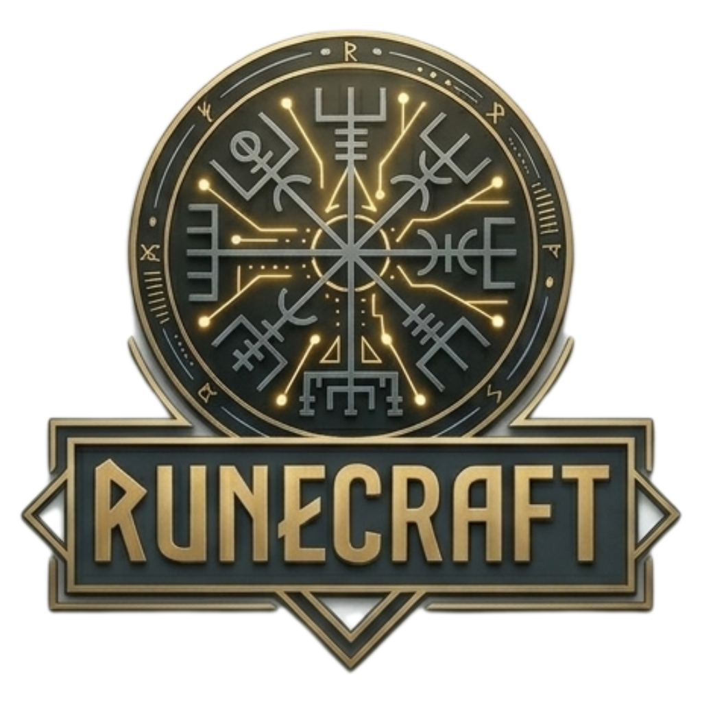

<p align="center">
  
</p>

<p align="center">
  <em>The forge where modern wizards bind their craft.</em>
</p>

<p align="center">
  <a href="https://bun.sh"></a>
  <a href="https://turbo.build"></a>
  <a href="./LICENSE"></a>
</p>

---

## The Arcanum

Every age has its wizards. Ours write TypeScript.

**Arcanum** is the central vault of the [Runecraft](https://github.com/runecraft) ecosystem — a monorepo where ancient sigils meet modern silicon. Here, skills are spells studied by AI agents, configurations are grimoires shared across the codebase, and the command line is the circle of summoning. Each package is an artifact: forged with intent, bound to a purpose, ready to be conjured into any project.

This is not a framework. It is a craft.

---

## Artifacts

| Artifact                             | Package                 | Bound Essence                                                                  | Status      |
| ------------------------------------ | ----------------------- | ------------------------------------------------------------------------------ | ----------- |
| [**Spells**](./packages/spells/)     | `@runecraft/spells`     | Skill scrolls — SKILL.md files studied by AI agents to learn specialized rites | Active      |
| [**Summon**](./packages/summon/)     | `@runecraft/summon`     | The summoning circle — CLI that invokes and installs spells into any project   | Scaffold    |
| [**Runes**](./packages/runes/)       | `@runecraft/runes`      | Carved sigils — OpenCode plugin that gives agents durable, per-repo memory     | Active      |
| [**Grimoire**](./packages/grimoire/) | `@runecraft/grimoire`   | Shared sigils — Biome and TypeScript configs inherited by every package        | Active      |
| [**Guild**](./packages/guild/)       | `@runecraft/guild`      | Party charters — multi-agent swarm and orchestration configurations            | Placeholder |
| [**Familiar**](./packages/familiar/) | `@runecraftai/familiar` | A bound familiar — internal Pi multi-agent runtime, not published              | Internal    |

---

## Quickstart

```bash
bun install
bun run build
```

Common incantations:

```bash
bunx turbo lint
bunx turbo test
bunx turbo build
```

---

## Stack

- **[Bun](https://bun.sh) workspaces** — native package linking and runtime
- **[Turborepo](https://turbo.build) v2** — task orchestration with caching and parallelization
- **[Changesets](https://github.com/changesets/changesets)** — independent semver versioning per artifact
- **[Biome](https://biomejs.dev)** — unified lint and format, configured via grimoire

---

[CONTRIBUTING](./CONTRIBUTING.md) &nbsp;·&nbsp; [Architecture](./.specs/) &nbsp;·&nbsp; [MIT](./LICENSE)
