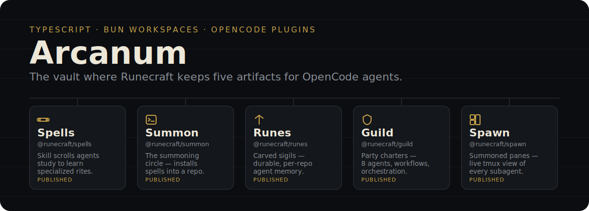

<p align="center">
  
</p>

<p align="center">
  <a href="https://bun.sh"></a>
  <a href="https://turbo.build"></a>
  <a href="./LICENSE"></a>
</p>

## Artifacts

Five independent packages, each installable on its own — none of them require the others.

| Artifact                             | Package                 | What it does                                                                | Status    |
| ------------------------------------ | ------------------------ | ---------------------------------------------------------------------------- | --------- |
| [**Spells**](./packages/spells/)     | [`@runecraft/spells`](https://www.npmjs.com/package/@runecraft/spells)     | 17 `SKILL.md` files AI agents load as specialized instructions               | Published |
| [**Summon**](./packages/summon/)     | [`@runecraft/summon`](https://www.npmjs.com/package/@runecraft/summon)     | Interactive CLI that installs Spells (and other tools) into any project      | Published |
| [**Runes**](./packages/runes/)       | [`@runecraft/runes`](https://www.npmjs.com/package/@runecraft/runes)       | OpenCode plugin giving agents durable, SQLite-backed, per-repo memory        | Published |
| [**Guild**](./packages/guild/)       | [`@runecraft/guild`](https://www.npmjs.com/package/@runecraft/guild)       | OpenCode plugin: 8 RPG-themed agents, workflows, and orchestration hooks     | Published |
| [**Spawn**](./packages/spawn/)       | [`@runecraft/spawn`](https://www.npmjs.com/package/@runecraft/spawn)       | OpenCode plugin that opens a live tmux pane for every subagent               | Published |
| [Grimoire](./packages/grimoire/)     | `@runecraft/grimoire`    | Shared Biome + TypeScript configs, inherited by every package above          | Internal  |
| [Familiar](./packages/familiar/)     | `@runecraftai/familiar`  | Internal Pi multi-agent runtime — private, not published                     | Internal  |

## What this is

**Arcanum** is the monorepo behind the [Runecraft](https://github.com/runecraftai) family of [OpenCode](https://opencode.ai) tooling. It's a Bun workspace, not a framework: each package above ships and versions independently on npm, and picking one doesn't pull in the rest.

## Why five separate packages

Memory, orchestration, skill definitions, installation, and terminal visibility are different concerns with different lifecycles — Runes changes on a different cadence than Spawn, and a user who only wants persistent memory shouldn't have to install an 8-agent orchestration layer to get it. Splitting them keeps each package's surface area small enough to reason about, test, and version on its own.

## How it works

- **[Bun](https://bun.sh) workspaces** link `packages/*` together for local development; published packages resolve `workspace:*` to real semver ranges via `bun pm pack`.
- **[Turborepo](https://turbo.build) v2** orchestrates `build`/`lint`/`test` across packages with caching and dependency-aware ordering.
- **Conventional commits → [Changesets](https://github.com/changesets/changesets)**: a commit like `feat(runes): add stats tool` is turned into a changeset automatically by `.changeset/generate-from-commits.ts`, which drives the version bump and changelog on release. `.changeset/*.md` files are never hand-authored.
- **[Biome](https://biomejs.dev)**, configured once in `@runecraft/grimoire` and inherited by every other package, enforces one lint/format standard monorepo-wide.

## How to use

Working in this monorepo:

```bash
bun install
bun run build
```

Common commands:

```bash
bunx turbo lint
bunx turbo test
bunx turbo build
```

Using one artifact in your own project — you don't need this repo at all, just install the package:

```bash
npx @runecraft/summon install       # browse and install skills
```

Each package's own README ([guild](./packages/guild/), [runes](./packages/runes/), [spells](./packages/spells/), [summon](./packages/summon/), [spawn](./packages/spawn/)) has the full install and usage instructions for that artifact specifically.

## Contributing

See [CONTRIBUTING.md](./CONTRIBUTING.md) for the changeset-free commit workflow (changesets are generated from conventional commits, not written by hand) and the automated release pipeline. Architecture notes live under [`.specs/`](./.specs/).

## License

[MIT](./LICENSE)
