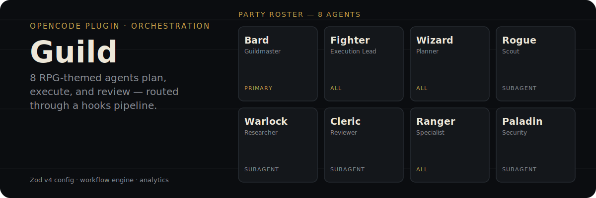

<p align="center">
  
</p>

Guild is a multi-agent orchestration plugin for [OpenCode](https://opencode.ai). It registers 8 role-scoped agents, a hooks pipeline, a workflow engine, and an analytics recorder, so a task moves through planning → execution → review without you manually switching agents.

## The roster

| Agent | Mode | Role |
| --- | --- | --- |
| **Bard** (Guildmaster) | `primary` | Default landing agent. Understands intent, routes to Wizard or Fighter, coordinates the plan → execute cycle. |
| **Fighter** (Execution Lead) | `all` | Drives todo-list execution of an existing plan. Launched by `/start-work` in a separate session so Bard's window stays clean. |
| **Wizard** (Planner) | `all` | Interactive planning loop — asks clarifying questions with 2–4 explicit options, never assumes. Never writes implementation code. |
| **Ranger** (Specialist) | `all` | Generic worker; becomes a per-category `ranger-<name>` agent when you define `categories` in config, routed by file-path pattern. |
| **Rogue** (Scout) | `subagent` | Read-only codebase explorer — grep/glob/read only, the cheapest agent, for context gathering before an edit. |
| **Warlock** (Researcher) | `subagent` | External documentation lookups with source citations. |
| **Cleric** (Reviewer) | `subagent` | Reviews completed work with a critical but fair eye; rejects only for true blocking issues. |
| **Paladin** (Security) | `subagent` | Audits changes touching auth, crypto, tokens, or input handling. |

Full behavior and delegation rules for each agent: [docs/agents.md](docs/agents.md).

## Why not just prompt a general agent

A single general-purpose agent conflates planning, execution, and review into one context, which makes it hard to keep a plan stable while implementation is underway. Guild separates those concerns into agents with different tool permissions and different jobs — Wizard is not allowed to write code, Rogue is not allowed to write anything, Fighter runs in its own session so a long execution doesn't crowd out the planning conversation you started in Bard. Routing between them is handled by hooks and skills, not manual agent-switching.

## How it works

- **Hooks pipeline** (`src/hooks/`) reacts to session lifecycle events — `start-work`, context-window monitoring, compaction recovery, write guards — each one togglable via config.
- **Skill-driven planning** — Wizard loads `guild-scope`, `guild-spec`, `guild-plan`, `guild-handoff`, and `guild-verify` at startup instead of carrying long inline rules, and generates an artifact set sized to the task: a single plan doc for a quick fix, or plan + `design.md` + `tasks.md` for a complex feature.
- **Workflow engine** — a named JSON sequence of `interactive`, `autonomous`, and `gate` steps, controllable mid-run via **pause**, **resume**, **skip this step**, **abort**.
- **Category-based dispatch** — Fighter routes work to domain-specific `ranger-<category>` agents by glob pattern, so different parts of a codebase can use different models.

## Install

### 🤖 Let an LLM do it (Recommended)

Paste this into any LLM agent (OpenCode, Claude Code, Cursor, etc.):

```text
Install the guild plugin by following: https://raw.githubusercontent.com/runecraftai/arcanum/main/packages/guild/README.md
```

<details>
<summary><b>Instructions for LLM Agents</b></summary>

To install this plugin, please perform the following steps for the user:

1.  **Configure OpenCode:**
    Add `"@runecraft/guild"` to the `plugin` array in the user's config file (usually `~/.config/opencode/opencode.json`).

    ```json
    {
      "plugin": [
        "@runecraft/guild"
      ]
    }
    ```

2.  **Finalize:**
    Tell the user: **"Installation complete! Please restart OpenCode — the plugin is auto-installed and loaded at startup."**

</details>

### 👤 For Humans (Manual)

Add `"@runecraft/guild"` to the `plugin` array in your `~/.config/opencode/opencode.json`:

```json
{
  "plugin": [
    "@runecraft/guild"
  ]
}
```

If you already have other plugins configured, just append it to the array:

```json
{
  "plugin": [
    "some-other-plugin",
    "@runecraft/guild"
  ]
}
```

Restart OpenCode — npm plugins are auto-installed and loaded at startup. No `bun add` or `npm install` required.

## Where to go next

| If you want to… | Read |
| --- | --- |
| Get a working install step-by-step | [docs/getting-started.md](https://github.com/runecraftai/arcanum/tree/main/packages/guild/docs/getting-started.md) |
| Configure agents, skills, and categories | [docs/configuration.md](https://github.com/runecraftai/arcanum/tree/main/packages/guild/docs/configuration.md) |
| See all slash commands | [docs/commands.md](https://github.com/runecraftai/arcanum/tree/main/packages/guild/docs/commands.md) |
| Diagnose a problem | [docs/troubleshooting.md](https://github.com/runecraftai/arcanum/tree/main/packages/guild/docs/troubleshooting.md) |
| Browse the full docs index | [docs/README.md](https://github.com/runecraftai/arcanum/tree/main/packages/guild/docs/README.md) |

## Config at a glance

- **Project config**: `.opencode/guild-opencode.jsonc` (or `.json`)
- **User config**: `~/.config/opencode/guild-opencode.jsonc` (or `.json`)
- **State directory**: `.guild/` (plans, runtime, analytics)
- **Schema artifact**: `schema/guild-config.schema.json` in this repository and in the published npm package

See [docs/configuration.md](https://github.com/runecraftai/arcanum/tree/main/packages/guild/docs/configuration.md) for the full reference.

## 🔁 Workflows

A workflow is a named sequence of steps that orchestrates a multi-step task. Guild ships a workflow engine that supports `interactive`, `autonomous`, and `gate` steps, plus pause/resume/skip/abort controls via natural language.

### Where workflows live

- `.opencode/workflows/<name>.json` — project, committed to the repo
- `~/.config/opencode/workflows/<name>.json` — personal, machine-local

### A real example: research → plan → implement

This is the workflow you'll reach for most often. It researches the area, scouts the codebase, drafts a plan, gates on your approval, then implements and opens a PR. Source: [`docs/examples/workflows/research-plan-implement.json`](docs/examples/workflows/research-plan-implement.json).

```jsonc
{
  "name": "research-plan-implement",
  "description": "End-to-end feature development: research, scout, plan, approve, implement, PR.",
  "default_completion": { "method": "user_confirm" },
  "steps": [
    { "id": "research",    "type": "autonomous", "prompt": "Use the Warlock researcher to gather external docs and references. Save under .guild/runtime/<feature-slug>/research.md." },
    { "id": "scout",       "type": "autonomous", "prompt": "Use the Rogue scout to map the existing codebase surface for the feature. Save under .guild/runtime/<feature-slug>/scout.md." },
    { "id": "plan",        "type": "autonomous", "prompt": "Invoke the Wizard planner. Produce a plan with task breakdown and verification criteria under .guild/plans/<feature-slug>.md.",
      "completion": { "method": "plan_created" } },
    { "id": "review-plan", "type": "gate",       "prompt": "Show the plan. The user will edit it inline or approve before implementation." },
    { "id": "implement",   "type": "autonomous", "prompt": "Drive the plan to completion. Update the plan file's status as each task finishes.",
      "completion": { "method": "plan_complete" } },
    { "id": "pr",          "type": "autonomous", "prompt": "Open a pull request. Title: feat: <feature-slug>. Body: summary + plan/scout/research links." }
  ]
}
```

### Step types

| Type | Behavior |
| --- | --- |
| `interactive` | Back-and-forth with the user. |
| `autonomous` | Runs to completion without user input. |
| `gate` | Pauses for explicit human review. |

### Run a workflow

```text
/run-workflow research-plan-implement
```

### While a workflow runs

Type these in the chat to control it: **pause**, **resume**, **skip this step**, **abort**.

### More examples and reference

- [docs/examples/workflows/code-review.json](docs/examples/workflows/code-review.json) — review a PR with Cleric.
- [docs/examples/workflows/dependency-upgrade.json](docs/examples/workflows/dependency-upgrade.json) — bump a dep, run tests, gate on review.
- [Workflows — overview](docs/workflows/overview.md) — concepts and execution model.
- [Workflows — authoring](docs/workflows/authoring.md) — full JSON schema.
- [Workflows — controls](docs/workflows/controls.md) — pause/resume/skip/abort keywords.

## Built-in commands

- `/start-work` — hand off a plan to Fighter in a new session/window (Bard stays clean; falls back to in-session execution if spawning is unsupported)
- `/run-workflow` — run a multi-step workflow
- `/guild-health` — show config health and validation issues
- `/metrics` — analytics and plan metrics (opt-in)
- `/token-report` — token usage report across sessions

See [docs/commands.md](https://github.com/runecraftai/arcanum/tree/main/packages/guild/docs/commands.md) for syntax, behaviour, and failure modes.

## Development

- **Build**: `bun run build`
- **Test**: `bun test`
- **Typecheck**: `bun run typecheck`
- **Schema**: `bun run schema:config`
- **Clean**: `bun run clean`

See [CONTRIBUTING.md](../../CONTRIBUTING.md) for how to extend the package.

## Uninstall

Remove the plugin entry from `opencode.json`, then optionally clean up state:

```bash
rm -rf .guild/
rm -f .opencode/guild-opencode.jsonc .opencode/guild-opencode.json
rm -f ~/.config/opencode/guild-opencode.jsonc ~/.config/opencode/guild-opencode.json
```

## License

MIT
