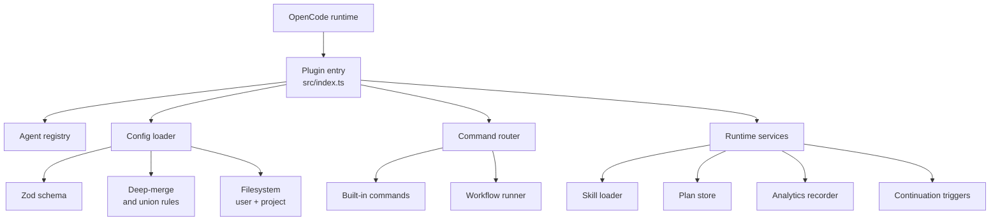

# Architecture

Guild is a TypeScript package that registers as an OpenCode plugin and adds workflow, skills, and analytics on top of a standard OpenCode session. This page describes the major components, the data flow at startup, and the on-disk state layout.

For user-facing concepts, start with [Getting started](getting-started.md). For configuration, see [Configuration](configuration.md).

## High-level shape

Guild is structured by responsibility. The dependency direction is one-way: outer layers depend on inner layers, never the reverse.



The plugin entry registers everything with OpenCode at startup: agents, slash commands, hooks, and runtime services. OpenCode then calls into Guild on the relevant hooks (chat messages, tool calls, completions).

## Components

### Plugin entry (`src/index.ts`)

The single export that OpenCode loads. It accepts the runtime hook surface and returns a registered plugin object. Responsibilities:

- Build the merged config from user and project files.
- Construct the agent registry (Bard, Fighter, Ranger, plus category Rangers, plus custom agents).
- Register the five built-in slash commands.
- Install the command router and workflow runner.
- Wire continuation triggers (compaction recovery, idle prompts).

### Config loader

Loads `guild-opencode.jsonc|json` from user and project paths, validates each against the Zod schema, and produces a single merged config.

The loader is **tolerant**: if a top-level section fails validation, it is dropped, a warning is logged, and the loader moves on to the next section. If the entire config is invalid, the loader falls back to defaults. This means a typo in one section does not break the whole session.

See [Configuration](configuration.md) for the merge rules.

### Agent registry

Built at startup from the merged config. The registry contains:

- The eight built-in agents (Bard, Fighter, Ranger, Wizard, Rogue, Warlock, Cleric, Paladin).
- Optional `ranger-<category>` agents derived from the `categories` section.
- Optional review-model variants for Cleric and Paladin derived from `review_models`.
- Any `custom_agents` from the merged config.

Wizard runs in `mode: all` — selectable as a primary and callable as a subagent. This enables the interactive planning loop where Bard delegates to Wizard, Wizard works directly with the user, and control returns to Bard when the plan is ready.

The registry is exposed to OpenCode as the list of available agents. See [Agents](agents.md) for details.

### Command router

Dispatches slash commands. Guild ships five: `/start-work`, `/run-workflow`, `/guild-health`, `/metrics`, `/token-report`. The router maps a command name to its handler.

For `/start-work`, the router resolves the target plan, validates it, and attempts to spawn Fighter in a new session/window. Bard stays active in the original window (clean-window model). If spawning fails (not supported or returns an error), the router falls back to an in-place agent switch and surfaces a clear message to the user: *"Could not open Fighter in new window. Running in current session instead."* No confirmation is required — execution proceeds and the user is informed.

If a command is not recognized, the message falls through to OpenCode as a normal chat turn.

### Workflow runner

Drives a workflow from start to finish. Responsibilities:

- Load the workflow JSON from `.opencode/workflows/` or `~/.config/opencode/workflows/`.
- Step through the workflow one step at a time, honoring the step's `type` (interactive, autonomous, gate).
- Detect completion signals (`user_confirm`, `plan_created`, `plan_complete`, `review_verdict`, `agent_signal`).
- Listen for natural-language controls (pause, resume, skip, abort).

See [Workflows](workflows/overview.md) for the user-facing model.

### Skill loader

Discovers skills from four sources (OpenCode API, project `.opencode/skills/`, user `~/.config/opencode/skills/`, package builtins, plus `skill_directories`). The higher-precedence source wins on name collision. See [Skills](skills.md).

### Plan store

A thin wrapper around the `.guild/plans/` directory. Plans are markdown files with a small frontmatter that records status (draft, in-progress, complete) and the workflow or plan they belong to. The store supports create, read, update, and list.

Wizard writes plans to `.guild/plans/<slug>/` using the skill-driven artifact-scope rule. Wizard loads `guild-scope`, `guild-spec`, `guild-plan`, `guild-handoff`, and `guild-verify` at startup — it does not carry long inline workflow rules. Small scopes get a single concise document, medium scopes get a full plan document, and large scopes get `spec.md` + `design.md` + `tasks.md` plus supporting artifacts as needed. Fighter reads from the same directory to drive execution.

### Analytics recorder

Writes to `.guild/analytics/` when analytics is enabled. Three files: `session-summaries.jsonl`, `fingerprint.json`, `metrics-reports.jsonl`. The recorder is the source of data for `/metrics`. See [Analytics](analytics.md).

### Continuation triggers

Two triggers:

- **Compaction recovery.** When OpenCode restores context after compaction, Guild injects a resume prompt.
- **Idle prompts.** When the session goes idle and `continuation.idle.enabled` is true, Guild injects a prompt if there is active work, an active workflow, or pending todos.

See [Continuation](continuation.md).

## On-disk state

Guild keeps all working memory under the project-local `.guild/` directory. This is the canonical home for context, plans, knowledge, and runtime state.

```
.guild/
├── context/              # Project-level state (single source of truth)
│   ├── project.md        # Project identity, tech stack, key files
│   ├── roadmap.md        # High-level milestones
│   ├── state.md          # Current project status and blockers
│   └── handoff.md        # Last handoff summary
├── knowledge/            # Persistent cross-plan learnings
│   ├── index.md
│   ├── decisions.md
│   ├── conventions.md
│   └── gotchas.md
├── plans/                # Active planning workspaces
│   └── <slug>/
│       ├── spec.md
│       ├── design.md
│       ├── tasks.md
│       ├── state.md
│       └── notes.md
├── archive/              # Completed or abandoned plans
├── runtime/              # Run records and per-step state (auto-managed)
└── analytics/            # Optional, only if analytics.enabled = true
    ├── session-summaries.jsonl
    ├── fingerprint.json
    └── metrics-reports.jsonl
```

Add `.guild/` to `.gitignore`. None of these files should be committed.

> **Legacy paths (`.specs/`, `.notebook/`)**: These are **fallback only**. Guild reads them when `.guild/context/` or `.guild/knowledge/` is absent or empty. Writes always go to `.guild/`. See [`.guild/architecture.md`](.guild/architecture.md) for the full canonical layout, migration rules, and stop conditions.

User-level config and user workflows live outside the project:

```
~/.config/opencode/
├── guild-opencode.jsonc     # User config
├── workflows/<name>.json     # User workflows
└── skills/<name>/SKILL.md    # User skills
```

## Where to look in the source

| Area | Path |
| --- | --- |
| Plugin entry | `packages/guild/src/index.ts` |
| Config schema and merge | `packages/guild/src/config/{schema,merge}.ts` |
| Config loading | `packages/guild/src/infrastructure/fs/config-fs-loader.ts` |
| Agent registry | `packages/guild/src/features/agent-registry/` |
| Built-in commands | `packages/guild/src/features/builtin-commands/` |
| Command router | `packages/guild/src/application/commands/command-router.ts` |
| Workflow | `packages/guild/src/features/workflow/` |
| Skills | `packages/guild/src/features/skill-loader/` |
| Analytics | `packages/guild/src/features/analytics/` |
| Continuation | `packages/guild/src/config/continuation.ts` |

## See also

- [Getting started](getting-started.md)
- [Configuration](configuration.md)
- [Agents](agents.md)
- [Workflows](workflows/overview.md)
- [`.guild/architecture.md`](.guild/architecture.md) — canonical layout definition, state update rules, and migration notes.
