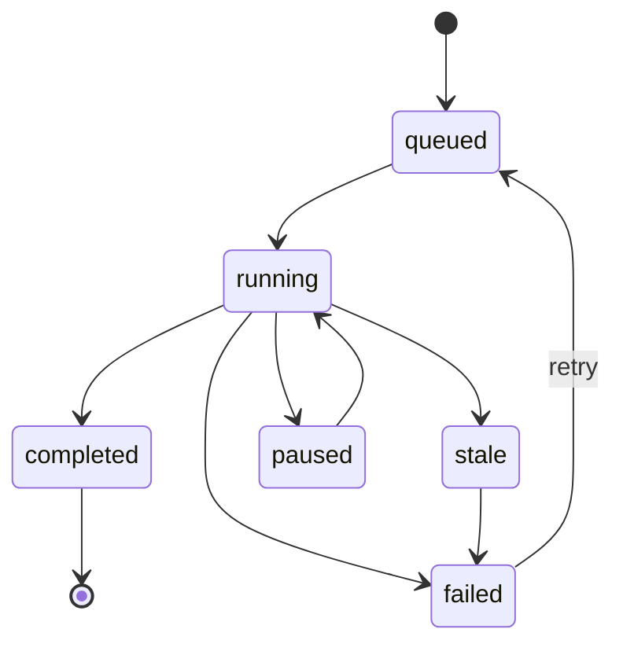

# Background agents

Background agents let a workflow hand off work that does not need to block the main session. They run concurrently, write results to the plan store, and report status through `/guild-health` and the runtime directory. This page documents the configuration, the run lifecycle, and how to keep an eye on them.

For the schema field, see [Configuration](configuration.md#background). For the commands that interact with background runs, see [Commands](commands.md).

## What a background run looks like

A background run is a single agent invocation with its own model, prompt, and tool policy. The run produces a plan file under `.guild/plans/` and a run record under `.guild/runtime/`. The main session can continue while the background run executes.



The transitions are:

- `queued` — accepted, waiting for an execution slot.
- `running` — actively executing.
- `paused` — paused by a control keyword; resumes on `continue`.
- `completed` — finished successfully.
- `failed` — finished with an error. Eligible for retry up to the configured limit.
- `stale` — silent for longer than `staleTimeoutMs`. Auto-transitions to `failed`.

## Configuration

The full `background` config block:

```jsonc
{
  "background": {
    "enabled": true,
    "concurrency": 3,
    "staleTimeoutMs": 120000,
    "maxRetries": 1,
    "roles": {
      "planner":  { "model": "openai/gpt-5-mini" },
      "executor": { "model": "openai/gpt-5-mini" },
      "reviewer": { "model": "opencode-go/qwen3.5-plus" }
    }
  }
}
```

| Field | Default | Notes |
| --- | --- | --- |
| `enabled` | `false` | Master switch. Background runs are not started when false. |
| `concurrency` | `2` | Maximum concurrent background runs. |
| `staleTimeoutMs` | `120000` | A run that has not produced output in this many milliseconds is marked `stale`. **Minimum: 60000.** |
| `maxRetries` | `1` | Maximum number of automatic retries for a `failed` run. |
| `roles` | inherited | Per-role model overrides. |

When `roles.<role>.model` is not set, the role uses the agent's default model. See [Model guide](model-guide.md) for the defaults.

## The 60-second minimum

`staleTimeoutMs` is bounded below by 60000 (one minute). Setting it lower is rejected by the config validator. The reason is operational: a sub-minute stale timeout flags normal long-running model calls as stale and creates noise.

If you have a workload that genuinely needs sub-minute detection, the supported path is a custom hook in OpenCode — not a lower `staleTimeoutMs`.

## Roles

Guild distinguishes three roles in a background run:

- **Planner** — produces the plan that the executor will work from. Used when a background run is launched without an existing plan.
- **Executor** — implements the plan.
- **Reviewer** — runs after the executor to check the work. Defaults to Cleric.

Per-role models are useful when you want a strong model for the planner and a cheap one for the executor.

## Lifecycle details

### Queued → running

A run enters `queued` when accepted and moves to `running` when a concurrency slot is available. If `concurrency` is 1, additional runs wait until the current one completes.

### Paused and resumed

The same natural-language controls that apply to foreground workflows apply to background runs: `pause` and `continue`. The effect is identical — the run stops advancing and waits for a resume.

### Failure and retry

A run that finishes with an error transitions to `failed`. If `maxRetries` is greater than zero, the run is re-queued automatically. The retry counter is per run, not global, and resets only on a successful completion.

### Stale runs

If a run is silent for longer than `staleTimeoutMs`, it is marked `stale` and then auto-failed. This catches runs that have died without producing a clean error (network drop, process crash, model provider outage). A stale run does not retry.

## Inspecting runs

Two ways to inspect background runs:

1. **`/guild-health`** — reports the current count of background runs by status.
2. **The runtime directory** — `.guild/runtime/` contains one JSON file per run, with timestamps, status, and last output. Read the latest entry to see what a run is doing right now.

For long-term analysis, the analytics metrics file includes per-step timing for background runs. See [Analytics](analytics.md).

## When to use background agents

Good fits:

- Long, mechanical work that the user does not need to watch: dependency upgrades, test runs, type fixes.
- A workflow that fans out into independent investigations.
- A build that needs to happen in parallel with planning.

Bad fits:

- Anything that needs the user's next decision. Use a foreground `gate` step instead.
- Tiny, fast tasks. The overhead of queuing and tracking exceeds the work.
- Tasks with tight coupling to in-memory session state. Background runs start a fresh context.

## See also

- [Configuration — Background](configuration.md#background)
- [Commands](commands.md) — `/guild-health` for run status.
- [Analytics](analytics.md) — metrics for background runs.
- [Troubleshooting](troubleshooting.md)
