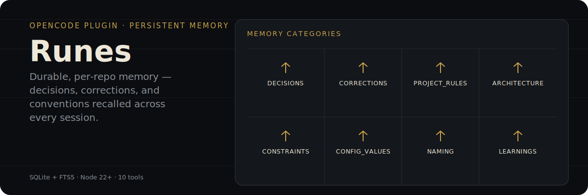

<p align="center">
  
</p>

Persistent cross-session memory for [OpenCode](https://opencode.ai) agents. Runes is a thin, native plugin that gives an agent durable memory of a project's decisions, corrections, conventions, and learnings — scoped per repo, backed by local SQLite, no extra CLI required to use it day to day.

## The 10 tools

| Tool                | Purpose                                                                   |
| -------------------- | -------------------------------------------------------------------------- |
| `rune_save`         | Persist a new memory (category, title, what, why, where_ref, learned, …). |
| `rune_search`       | Full-text search over memories (FTS5), filtered by project and category.  |
| `rune_get`          | Fetch one memory by id.                                                   |
| `rune_update`       | Patch fields of an existing memory.                                       |
| `rune_delete`       | Soft-delete a memory.                                                     |
| `rune_context`      | Recent + relevant memories + active session, scoped to the project.       |
| `rune_timeline`     | List recent sessions for the project.                                     |
| `rune_stats`        | Per-category counts and last activity.                                    |
| `rune_session_start`| Begin a session (idempotent if one is already active).                    |
| `rune_session_end`  | End the active session with an optional summary.                          |

## What the agent does on its own

The `using-runes` skill ships with the plugin and is always active. It tells the agent to:

1. **At session start** — call `rune_context` to load the project's recent memories and the active session.
2. **On a decision / correction / convention** — call `rune_save` with the right `category` from the 8 above.
3. **Before acting on a topic the user referenced** — call `rune_search` (or `rune_context(query=...)`) to recall prior decisions and corrections.
4. **Curation** — keep each category to top-10, merge duplicates, prioritize by importance.

You don't call `rune_*` tools directly — the agent decides when to recall and save.

## Why not just prompt the agent to "remember" things

Prompted memory lives in the conversation and evaporates the moment context is compacted or the session ends. Runes stores memories in a real SQLite database keyed by project (via `git config --get remote.origin.url`, normalized, or absolute path if there's no remote), so a decision saved in Monday's session is still searchable on Friday, in a different session, on the same repo — including its worktrees.

## Why 8 categories instead of a single memory blob

`decisions` · `corrections` · `project_rules` · `architecture` · `constraints` · `config_values` · `naming` · `learnings`

A flat memory dump degrades into noise the agent has to re-read in full every time. Categorizing lets `rune_context` and `rune_search` pull only what's relevant to the current task, and lets the skill enforce a per-category cap (top-10) so old, superseded entries get pruned instead of accumulating forever. See the `using-runes` skill for one-line guidance per category.

## Install

### 🤖 Let an LLM do it (Recommended)

Paste this into any LLM agent (OpenCode, Claude Code, Cursor, etc.):

```text
Install the runes plugin by following: https://raw.githubusercontent.com/runecraftai/arcanum/main/packages/runes/README.md
```

<details>
<summary><b>Instructions for LLM Agents</b></summary>

To install this plugin, please perform the following steps for the user:

1.  **Configure OpenCode:**
    Add `"@runecraft/runes"` to the `plugin` array in the user's config file (usually `~/.config/opencode/opencode.json`).

    ```json
    {
      "plugin": [
        "@runecraft/runes"
      ]
    }
    ```

2.  **Finalize:**
    Tell the user: **"Installation complete! Please restart OpenCode — the first session will auto-create the data dir and migrate the schema."**

</details>

### 👤 For Humans (Manual)

Add `"@runecraft/runes"` to the `plugin` array in your `~/.config/opencode/opencode.json`:

```json
{
  "plugin": [
    "@runecraft/runes"
  ]
}
```

If you already have other plugins configured, just append it to the array:

```json
{
  "plugin": [
    "some-other-plugin",
    "@runecraft/runes"
  ]
}
```

Restart OpenCode. The first session will auto-create the data dir and migrate the schema.

> **Requires Node 22+** (uses the built-in `node:sqlite`).

## The CLI

Inspect and maintain your memory from the terminal:

```bash
runes search "auth flow"     # markdown table of matches
runes stats                  # per-category counts
runes doctor                 # health check; detects FTS5 drift
runes doctor --purge         # hard-delete soft-deleted rows + rebuild FTS5
runes help
```

The CLI reads `RUNES_DATA_DIR` (or defaults to `~/.runes/`).

## Data location

- **Default:** `~/.runes/runes.db` (cross-platform — works on macOS, Linux, Windows).
- **Override:** set `RUNES_DATA_DIR=/some/path` in the environment.
- **Per-repo scoping:** the project is identified by `git config --get remote.origin.url` (normalized), or the absolute path when there's no remote. Worktrees of the same repo share data.

## Configuration

Two JSONC files, merged with project winning on scalars and arrays unioned:

- **User:** `~/.config/opencode/runes.jsonc`
- **Project:** `<project>/.opencode/runes.jsonc`

```jsonc
{
  "disabled_skills": [],   // string[] — names of skills to skip
  "disabled_tools": [],    // string[] — names of rune_* tools to skip
  "data_dir": "~/.runes",  // string — override RUNES_DATA_DIR
  "importance_floor": 5    // 1..10 — minimum importance when saving
}
```

Invalid JSONC is logged and ignored — the plugin always loads.

## ⚠️ Don't save secrets

Runes persists to a local SQLite file in plaintext. The skill instructs the agent to never save tokens, API keys, passwords, or PII. **Treat the data dir as confidential.** A regex-based scrubber is planned for v0.3.

## Uninstall

Remove `@runecraft/runes` from `opencode.json#plugin` and delete the data dir:

```bash
rm -rf ~/.runes/
```

## Develop

```bash
cd packages/runes
bun test                    # unit + integration
bun run typecheck
bun run build               # produces dist/index.js + dist/bin/runes.js
node -e "import('./dist/index.js')"  # smoke-test the plugin module
```

## License

MIT — see `LICENSE`.
