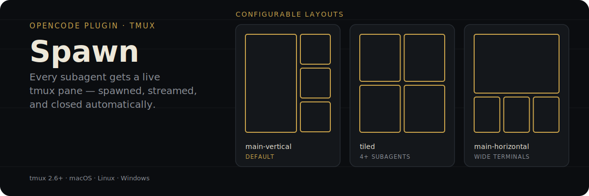
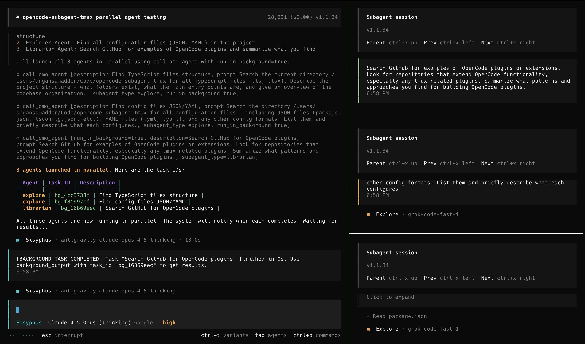

<p align="center">
  
</p>

<p align="center">
  <a href="https://www.npmjs.com/package/@runecraft/spawn"></a>
  <a href="https://opensource.org/licenses/MIT"></a>
</p>

An [OpenCode](https://opencode.ai) plugin that opens a tmux pane the moment a subagent starts, streams its output live via `opencode attach`, and closes the pane when the subagent's session is deleted.

## Proof

<p align="center">
  
</p>

Three background subagents (`explore`, `explore`, `librarian`) running in parallel, each visible in its own pane on the right while the main OpenCode session stays usable on the left — the default `main-vertical` layout.

## Why not just read the subagent's final output

By the time a subagent finishes, its intermediate reasoning and tool calls are gone unless you were tailing logs. Spawn gives every subagent a real terminal you can watch live, so you see a background `explore` or `librarian` task working — not just its summary after the fact.

- **Agent-agnostic**: works with oh-my-opencode, omoc-slim, or vanilla OpenCode.
- **Cross-platform**: macOS, Linux, and Windows (via PowerShell or WSL).
- **Crash fix**: the subagent lifecycle crash from earlier versions is fixed — `beforeExit` handler removed, poll errors made non-fatal, shutdown guards added.

## How it works

- A pane opens on the `session.created` event for any child (subagent) session, and closes only when that session is **deleted** from the OpenCode server — not when it goes idle.
- Pane spawns are serialized through a queue with retry and coalescing, so a burst of parallel subagents doesn't race tmux.
- A `ZombieReaper` scans for orphaned `opencode attach` processes and cleans them up if the server is abandoned mid-session.
- If you're not already inside tmux, the wrapper detects that and launches a session for you automatically.
- Multiple OpenCode instances running at once each get their own port, auto-selected from 4096–4106.

## Prerequisites

Spawn requires **tmux** to be installed and running on your system. OpenCode must also be installed.

| Platform | Install command |
|----------|----------------|
| macOS | `brew install tmux` |
| Ubuntu / Debian | `sudo apt install tmux` |
| Arch Linux | `sudo pacman -S tmux` |
| Fedora / RHEL | `sudo dnf install tmux` |
| Windows (WSL) | `sudo apt install tmux` inside your WSL distro |
| Windows (native) | `winget install tmux` (requires Windows 11 / winget) |

Verify the install: `tmux -V` — you need tmux **2.6+** for all layout features to work correctly.

> **Windows note:** Native Windows support runs via PowerShell or WSL. For the best experience, use WSL2 with a Linux distro and install tmux there.

## Installation

### 🤖 Let an LLM do it (Recommended)

Paste this into any LLM agent (OpenCode, Claude Code, Cursor, etc.):

```text
Install the spawn plugin by following: https://raw.githubusercontent.com/runecraftai/arcanum/main/packages/spawn/README.md
```

<details>
<summary><b>Instructions for LLM Agents</b></summary>

To install this plugin, please perform the following steps for the user:

1.  **Configure OpenCode:**
    Add `"@runecraft/spawn"` to the `plugin` array in the user's config file (usually `~/.config/opencode/opencode.json`).

    ```json
    {
      "plugin": [
        "@runecraft/spawn"
      ]
    }
    ```

2.  **Verify & Finalize:**
    *   Check if `tmux` is installed on the system. If not, advise the user to install it (e.g., `brew install tmux`, `sudo apt install tmux`, or `winget install tmux`).
    *   Tell the user: **"Installation complete! Please restart your terminal and run `opencode` to see the tmux integration in action."**

</details>

### 👤 For Humans (Manual)

Add `"@runecraft/spawn"` to the `plugin` array in your `~/.config/opencode/opencode.json`:

```json
{
  "plugin": [
    "@runecraft/spawn"
  ]
}
```

If you already have other plugins configured, just append it to the array:

```json
{
  "plugin": [
    "some-other-plugin",
    "@runecraft/spawn"
  ]
}
```

Restart your terminal and type `opencode`. The plugin handles the rest!

> **Note:** Make sure `tmux` is installed on your system (`brew install tmux`, `sudo apt install tmux`, or `winget install tmux`).

## 🛠️ Development

For contributors working on this plugin locally, see [LOCAL_DEVELOPMENT.md](https://github.com/runecraftai/arcanum/tree/main/packages/spawn/docs/LOCAL_DEVELOPMENT.md) for setup instructions.

## ⚙️ Configuration

You can customize behavior by creating `~/.config/opencode/spawn.json`:

```json
{
  "enabled": true,
  "port": 4096,
  "layout": "main-vertical",
  "main_pane_size": 60,
  "auto_close": true
}
```

| Option | Type | Default | Description |
|--------|------|---------|-------------|
| `enabled` | boolean | `true` | Enable/disable the plugin |
| `port` | number | `4096` | OpenCode server port |
| `layout` | string | `"main-vertical"` | Tmux layout: `main-horizontal`, `main-vertical`, `tiled`, etc. |
| `main_pane_size` | number | `60` | Size of main pane (20-80%) |
| `auto_close` | boolean | `true` | Auto-close panes when sessions complete |

## ❓ Troubleshooting

### Panes Not Spawning
1. Verify you're inside tmux: `echo $TMUX`
2. Check tmux is installed: `which tmux` (or `where tmux` on Windows)
3. Check logs: `cat /tmp/spawn.log`

### Server Not Found
Make sure OpenCode is started with the `--port` flag matching your config (the wrapper does this automatically).

## 🗺️ Roadmap

The following features are planned for future releases:
- **Glow Integration**: Support for [Glow](https://github.com/charmbracelet/glow) to render markdown beautifully in spawned panes.
- **Neovim Quick-Launch**: Direct integration to launch Neovim at the agent's current working directory.
- **Enhanced Customization**: More options for pane positioning, colors, and persistent layouts.

## 📄 License

MIT

## 🙏 Acknowledgements
This project extracts and improves upon the tmux session management from [oh-my-opencode-slim](https://github.com/alvinunreal/oh-my-opencode-slim) by alvinunreal, and [spawn](https://github.com/AnganSamadder/spawn) by Angan Samadder (MIT License).
