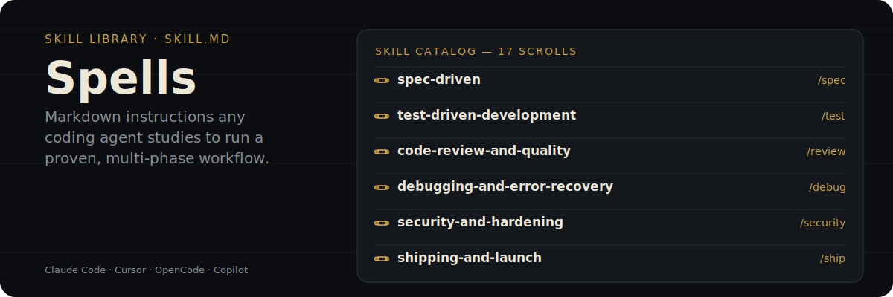

<p align="center">
  
</p>

<p align="center">
  <a href="https://www.npmjs.com/package/@runecraft/spells"></a>
  <a href="../../LICENSE"></a>
</p>

`SKILL.md` files loaded by AI coding agents (Claude Code, Cursor, GitHub Copilot, OpenCode, and others) as custom instructions. Each one teaches an agent how to run a specific, multi-phase workflow — planning, testing, review, security, deprecation, shipping — with the same precision each time instead of ad-hoc prompting.

## Available Skills

| Skill | Version | Description | Main Trigger | Docs |
|-------|---------|-------------|--------------|------|
| **spec-driven** | 5.0.0 | Spec-driven planning with 4 adaptive phases (Specify/Design/Tasks/Execute) + independent Verifier (author≠verifier) + self-improving lessons layer | `/spec` | [→ README](https://github.com/runecraft-dev/arcanum/tree/main/packages/spells/skills/spec-driven/README.md) |
| **git-commit-learning** | 1.0.0 | RPI model: analyze git log for patterns and write AI-learnable commits (Research → Plan → Implement → Verify). PT/EN. | `/commit` | [→ README](https://github.com/runecraftai/arcanum/tree/main/packages/spells/skills/git-commit-learning/README.md) |
| **git-worktree** | 1.0.0 | Use git worktrees for parallel feature branches without stashing or cloning. | `/worktree` | [→ README](https://github.com/runecraftai/arcanum/tree/main/packages/spells/skills/git-worktree/README.md) |
| **using-agent-skills** | 1.0.0 | Meta-skill: discover and dispatch to the right Arcanum skill for the current task. | `/skill` | [→ README](https://github.com/runecraftai/arcanum/tree/main/packages/spells/skills/using-agent-skills/README.md) |
| **idea-refine** | 1.0.0 | Refine raw ideas through divergent/convergent thinking — expand options, stress-test assumptions. | `/plan` | [→ README](https://github.com/runecraftai/arcanum/tree/main/packages/spells/skills/idea-refine/README.md) |
| **interview-me** | 1.0.0 | One-question-at-a-time interview until ~95% confidence about user intent. | `/interview` | [→ README](https://github.com/runecraftai/arcanum/tree/main/packages/spells/skills/interview-me/README.md) |
| **memory-management** | 1.0.0 | Lightweight agent memory for non-Guild projects. Maintains project decisions and error patterns in a flat .agent-memory/ directory. | `/memory` | [→ README](https://github.com/runecraftai/arcanum/tree/main/packages/spells/skills/memory-management/README.md) |
| **doubt-driven-development** | 1.0.0 | Adversarial review of non-trivial decisions: CLAIM → EXTRACT → DOUBT → RECONCILE → STOP. | `/harden` | [→ README](https://github.com/runecraftai/arcanum/tree/main/packages/spells/skills/doubt-driven-development/README.md) |
| **test-driven-development** | 1.0.0 | TDD with the 80/15/5 pyramid and Beyonce Rule. Fail first, then make it pass. | `/test` | [→ README](https://github.com/runecraftai/arcanum/tree/main/packages/spells/skills/test-driven-development/README.md) |
| **typescript-patterns** | 1.0.0 | TypeScript best practices and patterns for type-safe, maintainable code. | `/typescript` | [→ README](https://github.com/runecraftai/arcanum/tree/main/packages/spells/skills/typescript-patterns/README.md) |
| **debugging-and-error-recovery** | 1.0.0 | Five-step root-cause triage: reproduce → localize → reduce → fix → guard. | `/debug` | [→ README](https://github.com/runecraftai/arcanum/tree/main/packages/spells/skills/debugging-and-error-recovery/README.md) |
| **code-review-and-quality** | 1.0.0 | Five-axis code review (correctness, readability, architecture, security, performance) with severity labels. | `/review` | [→ README](https://github.com/runecraftai/arcanum/tree/main/packages/spells/skills/code-review-and-quality/README.md) |
| **code-simplification** | 1.0.0 | Reduce complexity while preserving behavior — Chesterton's Fence, Rule of 500. | `/simplify` | [→ README](https://github.com/runecraftai/arcanum/tree/main/packages/spells/skills/code-simplification/README.md) |
| **security-and-hardening** | 1.1.0 | OWASP Top 10 and a three-tier boundary system for security-first development. | `/security` | [→ README](https://github.com/runecraftai/arcanum/tree/main/packages/spells/skills/security-and-hardening/README.md) |
| **deprecation-and-migration** | 1.0.0 | Retire old systems, APIs, and features; migrate users safely. Treats code as liability. | `/deprecate` | [→ README](https://github.com/runecraftai/arcanum/tree/main/packages/spells/skills/deprecation-and-migration/README.md) |
| **shipping-and-launch** | 1.0.0 | Pre-launch checklist, staged rollout, feature flag lifecycle, monitoring, rollback. | `/ship` | [→ README](https://github.com/runecraftai/arcanum/tree/main/packages/spells/skills/shipping-and-launch/README.md) |
| **skill-forge** | 1.0.0 | Meta-skill for creating new Agent Skills end-to-end. Aligned with the open SKILL.md format. 6-phase workflow (Discover → Design → Author → Validate → Optimize → Deliver) with bundled validator and trigger/output eval methodology. | `/forge` | [→ README](https://github.com/runecraftai/arcanum/tree/main/packages/spells/skills/skill-forge/README.md) |

## References

| File | Description |
|------|-------------|
| [testing-patterns.md](https://github.com/runecraftai/arcanum/tree/main/packages/spells/references/testing-patterns.md) | Common testing patterns across the stack with 80/15/5 pyramid, Beyonce Rule, and 8 anti-patterns. |
| [definition-of-done.md](https://github.com/runecraftai/arcanum/tree/main/packages/spells/references/definition-of-done.md) | Project-wide standing bar that complements per-task acceptance criteria. |

## Why a SKILL.md instead of a longer system prompt

A system prompt has to hold everything all the time, so it either stays generic or grows until it's expensive and hard to steer. A skill is loaded only when its trigger matches the task, and it's a plain file you can read, diff, and version — the same TDD process doesn't need to be re-explained by hand in every project's prompt.

## How it works

```text
@runecraft/spells/
├── skills/
│   ├── spec-driven/SKILL.md          # the 17 skills, one directory each
│   ├── test-driven-development/SKILL.md
│   ├── code-review-and-quality/SKILL.md
│   └── ...                           # each with SKILL.md + optional references/
└── references/                       # shared docs: testing-patterns.md, definition-of-done.md
```

Each skill is a `SKILL.md` file — the core agent instructions — plus, optionally, a `references/` folder the agent loads on demand as it works through a phase, instead of front-loading everything at once.

## How to use

Skills are installed by the **Summon** CLI, which picks the right destination directory for your detected agent(s):

```bash
npx @runecraft/summon install
```

See [@runecraft/summon](https://www.npmjs.com/package/@runecraft/summon) for the full reference, including `install-commands`, which generates `/review`, `/test`, `/ship`, etc. as real slash commands for Claude Code, OpenCode, and Cursor.

## Compatibility

| Agent | Status |
|-------|--------|
| Claude Code | ✅ Tested |
| Cursor | ✅ Tested |
| OpenCode | ✅ Tested |
| GitHub Copilot | ✅ Tested |
| Antigravity (Gemini) | ✅ Tested |

Works with any agent that supports custom instructions, skills, or rules directories.

## License

MIT

<p align="center"><sub>Part of the <a href="https://github.com/runecraftai/arcanum">Arcanum</a> monorepo</sub></p>
