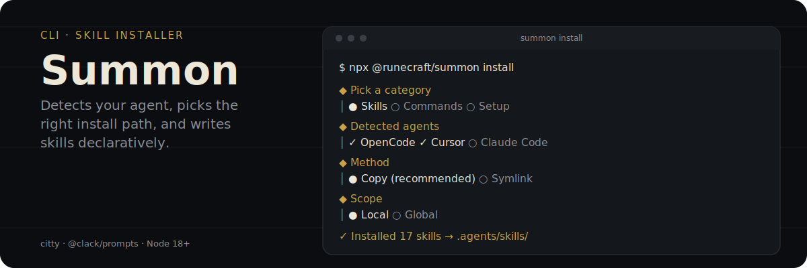

<p align="center">
  
</p>

<p align="center">
  <a href="https://www.npmjs.com/package/@runecraft/summon"></a>
  <a href="../../LICENSE"></a>
</p>

Interactive CLI for installing [Arcanum](../../README.md) agent skills — and, as of v0.16.0, external tools like Graphify and Context7 — into any project. Built on [citty](https://github.com/unjs/citty) and [@clack/prompts](https://github.com/bombshell-dev/clack).

## What it does

`summon` detects which coding agents you have (Claude Code, Cursor, OpenCode, Windsurf, Cline, GitHub Copilot, Roo Code, Aider, Kiro), walks you through picking skills from the [`@runecraft/spells`](https://www.npmjs.com/package/@runecraft/spells) catalog, and writes them to the right directory for each detected agent — no manual copying of `SKILL.md` files.

## Why not just copy the files by hand

Every agent expects skills in a different directory with a different naming convention — `.claude/skills/`, `.cursor/rules/`, `.agents/skills/`, and so on — and that mapping changes as agents add support. `summon` owns the mapping in [`agents/registry.ts`](./src/agents/registry.ts) so you pick a skill once and it lands correctly for whichever agents you actually have installed, instead of hand-copying files into the wrong place.

## How it works

- **Method vs. scope are orthogonal** — `method` (`copy` or `symlink`) is *how* the file lands; `scope` (`local` or `global`) is *where the symlink hub lives*, and is ignored entirely when `method=copy`.
- **`copy`** — self-contained snapshot, `cp SKILL.md → <agent.installDir>/<name>.md`. Works everywhere, doesn't update automatically.
- **`symlink`** — hub at `.agents/skills/<name>/` (local) or `~/.config/opencode/skills/<name>/` (global), agent points at the hub, hub points at `node_modules`. Updates automatically — best for developing on the skills themselves.
- **Idempotent** — re-running any command overwrites in place; no duplicates.

## How to use

### Install skills (interactive TUI)

```bash
npx @runecraft/summon install
```

Or just `npx @runecraft/summon` (no subcommand) — same flow. Works equally well with `npm install -g @runecraft/summon`, `bunx @runecraft/summon`, or `pnpm dlx`. Requires Node 18+.

The wizard walks you through:

1. **Pick a category** — Skills / Commands / Setup.
2. **Skills sub-flow:**
   1. **Detect agents** — Claude Code, Cursor, OpenCode, Windsurf, Cline, GitHub Copilot, Roo Code, Aider, Kiro. Detected ones are pre-selected.
   2. **Choose action** — Install / Update / Remove.
   3. **Pick skills** from the catalog (multi-select, grouped by category).
   4. **Choose method**:
      - **Copy** (recommended) — self-contained, works everywhere.
      - **Symlink** — updates automatically from source (best for development).
   5. **Choose scope**:
      - **Local** — this project only (writes to `<project>/.agents/skills/<name>/` hub).
      - **Global** — available everywhere (writes to `~/.config/opencode/skills/<name>/` hub).
   6. **Confirm** the summary, then run.

#### Method × Scope (orthogonal)

`method` and `scope` control different things and are independent choices:

| `method` \ `scope` | `local` | `global` |
|---|---|---|
| `copy` | `cp SKILL.md → <agent.installDir>/<name>.md`. Snapshot. `scope` is **ignored**. | Same as `local`. `scope` is **ignored**. |
| `symlink` | Hub at `<projectRoot>/.agents/skills/<name>/`, agent → hub → `node_modules`. | Hub at `~/.config/opencode/skills/<name>/`, agent → hub → `node_modules`. |

In short: `method` = **how** the file is installed (mechanism). `scope` = **where the symlink hub lives** (only relevant when `method=symlink`; for `copy`, the agent's `installDir` from `agents/registry.ts` is always used).

### Install slash commands

Generate slash-command files for detected AI runtimes so you can invoke skills with one keystroke (`/plan`, `/review`, `/test`, etc.).

```bash
npx @runecraft/summon install-commands
```

The TUI asks you to:

1. **Pick one or more project roots** (default: current directory). Type extra absolute paths separated by commas to apply in multiple projects at once.
2. **For each detected runtime, choose a location**:
   - `local` writes to the project.
   - `global` writes to `$HOME`.
3. **Confirm** the targets, then generate.

#### Supported runtimes

| Runtime | Local markers | Global path | Output (local) | Output (global) |
|---|---|---|---|---|
| Claude Code | `.claude/`, `CLAUDE.md` | `~/.claude/` | `<project>/.claude/commands/<name>.md` | `~/.claude/commands/<name>.md` |
| OpenCode | `.opencode/`, `opencode.json`, `opencode.jsonc` | `~/.config/opencode/` | `<project>/.opencode/commands/<name>.md` | `~/.config/opencode/commands/<name>.md` |
| Cursor | `.cursor/`, `.cursorrules` | _(none)_ | `<project>/.cursor/rules/<name>.mdc` | _(skipped)_ |

The 8 emitted commands (defined in `src/commands/registry.ts`) are **invokers**: `/plan`, `/review`, `/test`, `/simplify`, `/ship`, `/security`, `/debug`, `/harden`. Each command body loads the corresponding skill.

#### Example output

A generated `.opencode/commands/review.md` looks like:

```markdown
---
description: Review changes with five-axis critique
---

Current staged diff:

!`git diff --staged`

Load the `code-review-and-quality` skill and execute its process.

$ARGUMENTS
```

#### Behavior

- **Built-in collision detection**: `/review` is skipped for Claude Code (it ships a built-in `review` command) but emitted for OpenCode and Cursor.
- **Auto-install of missing skills**: when an invoker command's target skill is not already installed, `install-commands` copies the skill into the target runtime's skills dir (using `copy` method by default) before generating the command. The summary reports `Installed N/M missing skill(s)`. Set `installMissingSkills: false` from the API to fall back to skip-and-warn.
- **Missing-skill skip**: triggered when `installMissingSkills: false` is set, or when the target skill is not in the bundled spells catalog.
- **Invokers without a skill at runtime**: even with auto-install, an older command file may still point at a skill that was later removed. The generated invoker body includes a fallback line: `If the skill is unavailable, install it first with: \`npx @runecraft/summon install\`.`
- **Idempotent**: re-running overwrites in place, no duplicates.
- **No-runtime exit**: if no supported runtime is detected in any chosen project root, the command exits with code 1 and a clear message.

### Install external tools (Setup sub-flow)

`@runecraft/summon` used to ship `/setup-*` slash commands that asked the LLM agent to install Graphify, markitdown, MCP servers, and so on. As of v0.16.0, summon installs these tools **directly** — no LLM delegation, no OS-detection by an agent, idempotent.

```bash
npx @runecraft/summon tools install
```

The TUI asks:

1. **Scope** — global (user-scope, e.g. `~/.config/opencode/opencode.json` and `npm i -g`) or local (this project, e.g. `./.opencode/opencode.json` and `npm i`).
2. **Tools** — multi-select from: Graphify, markitdown, OpenCode DCP, Context7, Exa, grep.app, AGENTS.md.
3. **API keys** (only if relevant) — for Context7/Exa, summon asks for the value but writes a `${ENV_VAR}` reference into `opencode.json` and tells you to set the actual key in your shell profile. The literal key is never persisted in a config file.

You can also drive it from the CLI without the TUI:

```bash
# Install everything (defaults to global)
npx @runecraft/summon tools install

# Only some tools, dry-run
npx @runecraft/summon tools install graphify markitdown --dry-run

# Install into the current project
npx @runecraft/summon tools install --local

# Just see what's installed vs missing
npx @runecraft/summon tools list
```

#### Supported tools

| Tool | Scope | Steps (linux) | Steps (macos) | Notes |
|---|---|---|---|---|
| `graphify` | both | `npm i -g graphify` + `opencode.json` MCP entry | same | needs Node 18+ |
| `markitdown` | global | `apt-get install -y pipx` → `pipx install markitdown` | `brew install pipx` → `pipx install markitdown` | pipx is user-scope; `--local` rejected |
| `dcp` | global | `opencode plugin @tarquinen/opencode-dcp@latest --global` | same | needs `opencode` CLI |
| `context7` | both | MCP entry for `npx -y @upstash/context7-mcp` | same | API key via `${CONTEXT7_API_KEY}` |
| `exa` | both | MCP entry (remote `https://mcp.exa.ai/mcp`) | same | API key via `${EXA_API_KEY}` |
| `grep-app` | both | MCP entry (remote `https://mcp.grep.app`) | same | no key needed |
| `agents-md` | local | copy `docs/setup-prompts/agents-template.md` → `./AGENTS.md` | same | appends marker if file exists |

#### Behavior

- **Two-stage detect**: for MCP-backed tools, presence means both the binary (or the `opencode` CLI) **and** the `mcp.<name>` entry in the target `opencode.json`. If only the binary is present, the install proceeds and only adds the missing entry.
- **Idempotent**: re-running skips what's already present and merges missing entries.
- **Safe config merge**: when editing `~/.config/opencode/opencode.json` (or the project one), summon reads the file, deep-merges the new `mcp.<name>` entry, and writes the result. Other keys are preserved. If the file is corrupt JSON, summon writes a `.bak` and starts fresh.
- **API keys never persisted**: the value is asked via masked input, but the written entry is always `${ENV_VAR}` — the literal key never lands in `opencode.json`. Set it in your shell profile to use the tool.
- **Per-tool failure isolation**: if `markitdown` fails, `graphify` still tries.

#### Manual setup prompts

The original `setup-*.md` instructions are kept under [`docs/setup-prompts/`](./docs/setup-prompts/) for users who prefer to install by hand (CI, non-interactive shells, platforms the installer doesn't know). Each `.md` is the same instructions the LLM used to receive. See [`docs/setup-prompts/README.md`](./docs/setup-prompts/README.md) for the full rationale.

## Commands

| Command | What it does |
|---|---|
| `summon` _(no subcommand)_ | Launches the interactive TUI wizard. |
| `summon install` | Same TUI flow (explicit). |
| `summon install-commands` | Generate `/plan`, `/review`, `/test`, … for detected runtimes, with TUI picker for projects and per-runtime local/global. |
| `summon list` | Show installed skills grouped by agent. |
| `summon update` | Refresh installed skills to the latest catalog. |
| `summon remove` | Uninstall selected skills from agents. |
| `summon tools install` | Install external tools (Graphify, markitdown, MCP servers, AGENTS.md) directly. |
| `summon tools list` | Show external tool install state. |

**TUI integration:** running `summon install` ends with a prompt **"Generate slash commands for installed skills?"** — answering *yes* reuses the same project + location picker, defaulting to the just-installed skills.

## Stack

- **[citty](https://github.com/unjs/citty)** — lightweight CLI framework with lazy-loaded subcommands.
- **[@clack/prompts](https://github.com/bombshell-dev/clack)** — interactive terminal prompts with rich formatting.

## Development

```bash
cd packages/summon

# Run from source (no build needed)
bun run dev

# Build a Node-compatible binary at dist/summon.js
bun run build

# Verify the build (catches Bun-only APIs that would break Node)
bun run build:verify

# Run the test suite
bun test
```

Modify `src/cli.ts` for the main entry point, `src/commands/<sub>.ts` for subcommands, and `src/tui/<prompt>.ts` for interactive prompts.

## Publishing

The build uses Bun's bundler with `--target node` and the published package must work with both `npx` and `bunx`. Two critical constraints:

1. **`import.meta.dir` must not leak into the bundle** — it's Bun-only and `undefined` in Node.js. The `build:verify` script checks this automatically.
2. **`workspace:*` must be resolved to a real version** — npm doesn't understand the `workspace:` protocol. `bun pm pack` handles this automatically.

### Steps

```bash
cd packages/summon
```

1. **Bump the version** in `package.json`.
2. **Build and verify**:
   ```bash
   bun run build && bun run build:verify
   ```
3. **Create the tarball** (resolves `workspace:*` → actual versions):
   ```bash
   bun pm pack
   ```
4. **Publish with npm** (using the tarball so workspace deps are resolved):
   ```bash
   npm publish runecraft-summon-<VERSION>.tgz --otp <OTP>
   ```
5. **Clean up**:
   ```bash
   rm runecraft-summon-<VERSION>.tgz
   ```
6. **Verify** the published version works:
   ```bash
   npx @runecraft/summon@<VERSION>
   ```

### Why not `npm publish` directly?

`npm publish` from a workspace package publishes `"workspace:*"` as-is, which npm registries can't resolve. Using `bun pm pack` + `npm publish <tarball>` ensures the tarball contains resolved versions.

### Why not `bun publish`?

`bun publish` resolves workspace deps automatically but may have auth issues with npm tokens. If it works for you, you can use it instead of steps 3-5:

```bash
bun publish --otp <OTP>
```

---

## License

MIT
